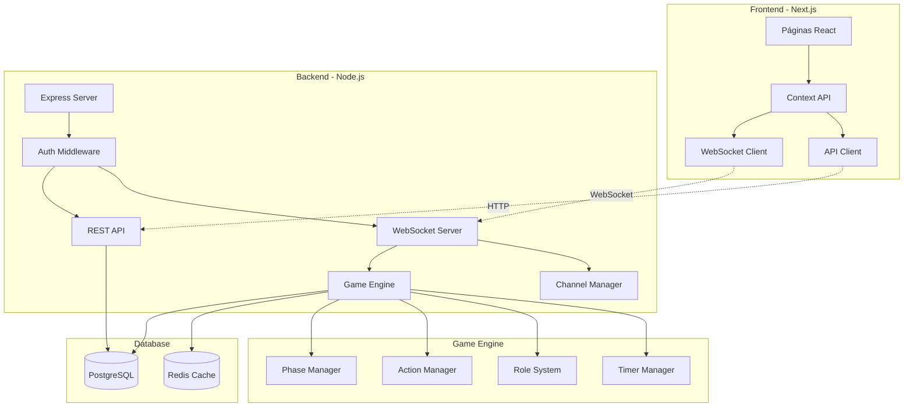

# 🐺 Werewolf Online - Plataforma de Jogos Multiplayer em Tempo Real

[](https://github.com/seu-usuario/werewolf-online)
[](https://werewolf-online.vercel.app)
[](https://www.typescriptlang.org/)
[](https://developer.mozilla.org/en-US/docs/Web/API/WebSocket)
[](https://www.docker.com/)

<div align="center">
  
</div>

## 📜 Sobre o Projeto

**Werewolf Online** é uma implementação completa e moderna do clássico jogo de dedução social "Lobisomem" (inspirado em Town of Salem), com arquitetura escalável e experiência imersiva. O jogo combina estratégia, blefe e investigação em partidas emocionantes de 6 a 15 jogadores.

Este projeto foi desenvolvido como parte do **Desafio Relâmpago 4 - Plataforma de Jogos Multiplayer em Tempo Real** do curso Alpha EdTech, demonstrando domínio completo de tecnologias modernas de desenvolvimento web.

### 🎯 Destaques do Projeto

- 🎮 **Gameplay Completo**: Sistema de jogo fiel ao clássico com múltiplos papéis e facções
- 🔌 **Real-time WebSocket**: Comunicação instantânea entre jogadores sem delays
- 🎨 **Interface Imersiva**: Design medieval atmosférico com animações suaves
- 🔐 **Sistema Robusto**: Autenticação JWT, salas privadas e reconexão automática
- 📱 **Responsivo**: Funciona perfeitamente em desktop, tablet e mobile
- 🐳 **Docker Ready**: Deploy simplificado com containers

## 🖼️ Demonstração Visual

### 🏠 **Página Inicial**
*Tela de boas-vindas com opções de login e registro*

<div align="center">
  
</div>

---

### 🎭 **Tela de Roles**
*Conheça todos os papéis disponíveis e suas habilidades especiais*

<div align="center">
  
</div>

---

### 🏛️ **Lobby Principal**
*Liste e crie salas públicas ou privadas*

<div align="center">
  
</div>

---

### ⏳ **Sala de Espera**
*Aguarde outros jogadores e converse antes do jogo começar*

<div align="center">
  
</div>

---

### 🌞 **Tela do Jogo - Dia**
*Interface completa com chat, ações, timer e informações dos jogadores durante o dia*

<div align="center">
  
</div>

---

### 🌙 **Tela do Jogo - Noite**
*Interface noturna com ações especiais e chat exclusivo dos lobisomens*

<div align="center">
  
</div>

## 🎮 Como Jogar

### 📋 Regras Básicas

**Werewolf** é um jogo de dedução social onde cada jogador recebe um papel secreto e deve trabalhar com sua facção para alcançar a vitória.

### 🏰 Facções

| Facção | Objetivo | Membros |
|--------|----------|---------|
| **🏘️ Vila** | Eliminar todos os Lobisomens e ameaças | Sheriff, Doctor, Vigilante, Villager |
| **🐺 Lobisomens** | Igualar ou superar o número da Vila | Werewolf King, Werewolf |
| **🃏 Neutros** | Objetivos únicos de cada papel | Jester, Serial Killer |

### 🎭 Papéis Principais

<details>
<summary><b>👑 Facção da Vila</b></summary>

| Papel | Habilidade | Estratégia |
|-------|------------|------------|
| **🔍 Sheriff** | Investiga 1 pessoa por noite | Encontre os lobisomens e lidere a vila |
| **💉 Doctor** | Protege 1 pessoa por noite | Mantenha jogadores importantes vivos |
| **🔫 Vigilante** | Mata 1 pessoa (3 usos) | Use com sabedoria, erros custam caro |
| **👤 Villager** | Apenas voto | Analise comportamentos e vote sabiamente |

</details>

<details>
<summary><b>🌙 Facção dos Lobisomens</b></summary>

| Papel | Habilidade | Estratégia |
|-------|------------|------------|
| **👑 Werewolf King** | Líder imune a investigação | Coordene ataques e engane o Sheriff |
| **🐺 Werewolf** | Vota em quem matar | Trabalhe em equipe e mantenha disfarce |

</details>

<details>
<summary><b>🎪 Facção Neutra</b></summary>

| Papel | Objetivo | Estratégia |
|-------|----------|------------|
| **🤡 Jester** | Ser executado pela vila | Aja suspeitosamente sem ser óbvio |
| **🔪 Serial Killer** | Ser o último vivo | Elimine todos discretamente |

</details>

### 🌅 Fases do Jogo

1. **🌞 Dia** (120s)
   - Discussão aberta entre todos os jogadores
   - Acusações e defesas
   - Votação para execução

2. **⚖️ Julgamento** (45s)
   - Jogador mais votado se defende
   - Vila decide: Culpado ou Inocente

3. **🌙 Noite** (40s)
   - Papéis especiais executam suas ações
   - Lobisomens escolhem sua vítima
   - Chat exclusivo para lobisomens

### 🎯 Composições Balanceadas

| Jogadores | Composição | Dificuldade |
|-----------|------------|-------------|
| **6** | 1 Lobisomem, 1 Sheriff, 1 Doctor, 3 Villagers | ⭐ Fácil |
| **9** | 2 Lobisomens, 1 Jester, 1 Sheriff, 1 Doctor, 1 Vigilante, 3 Villagers | ⭐⭐ Médio |
| **12** | 3 Lobisomens, 1 Jester, 1 Sheriff, 1 Doctor, 1 Vigilante, 5 Villagers | ⭐⭐⭐ Difícil |
| **15** | 4 Lobisomens, 1 Jester, 1 Serial Killer, 1 Sheriff, 1 Doctor, 1 Vigilante, 6 Villagers | ⭐⭐⭐⭐ Expert |

## ✨ Funcionalidades Principais

### 🎮 **Sistema de Jogo Completo**
- ✅ Engine de jogo com todas as mecânicas implementadas
- ✅ 8 papéis únicos com habilidades especiais
- ✅ Sistema de votação interativo em tempo real
- ✅ Fases automáticas com timers configuráveis
- ✅ Condições de vitória para todas as facções

### 💬 **Comunicação em Tempo Real**
- ✅ Chat público durante o dia
- ✅ Chat exclusivo dos lobisomens à noite
- ✅ Chat dos mortos (espectadores)
- ✅ Sistema de filtro de palavrões
- ✅ Indicadores de digitação

### 🏠 **Sistema de Salas**
- ✅ Salas públicas visíveis no lobby
- ✅ Salas privadas com código de 6 dígitos
- ✅ Configurações personalizáveis pelo host
- ✅ Kick de jogadores problemáticos
- ✅ Espectadores podem assistir partidas

### 🔐 **Segurança e Confiabilidade**
- ✅ Autenticação JWT segura
- ✅ Reconexão automática em caso de queda
- ✅ Proteção contra múltiplas contas
- ✅ Rate limiting e proteção DDoS
- ✅ Validação de todas as ações

### 🎨 **Interface e Experiência**
- ✅ Design medieval imersivo
- ✅ Animações suaves e responsivas
- ✅ Modo escuro por padrão
- ✅ Suporte completo para mobile
- ✅ Feedback visual para todas as ações

### 📊 **Extras e Melhorias**
- ✅ Sistema de níveis e experiência
- ✅ Histórico de partidas
- ✅ Estatísticas detalhadas
- ✅ Tutorial interativo
- ✅ Conquistas desbloqueáveis

## 🛠️ Stack Tecnológica

### **Frontend** 🎨
- **Framework**: [Next.js 14](https://nextjs.org/) com App Router
- **Linguagem**: [TypeScript](https://www.typescriptlang.org/) 
- **Estilização**: [Tailwind CSS](https://tailwindcss.com/)
- **Animações**: [Framer Motion](https://www.framer.com/motion/)
- **Estado**: Context API + Hooks customizados
- **WebSocket**: Cliente nativo com reconexão automática

### **Backend** ⚙️
- **Runtime**: [Node.js](https://nodejs.org/) 18+
- **Framework**: [Express.js](https://expressjs.com/)
- **WebSocket**: [ws](https://github.com/websockets/ws) nativo
- **Autenticação**: JWT com refresh tokens
- **Validação**: Middlewares customizados
- **Logger**: Winston com níveis configuráveis

### **Banco de Dados** 🗄️
- **Principal**: [PostgreSQL 15](https://www.postgresql.org/)
- **Cache**: [Redis](https://redis.io/) (preparado para Fase 2)
- **ORM**: Queries SQL nativas otimizadas
- **Migrations**: Scripts SQL versionados

### **DevOps** 🐳
- **Containerização**: Docker + Docker Compose
- **CI/CD**: GitHub Actions
- **Monitoramento**: Health checks automáticos
- **Deploy**: Pronto para Kubernetes

## 🚀 Como Executar

### 📋 Pré-requisitos

- Node.js 18+ e npm 9+
- Docker e Docker Compose
- Git

### 🐳 **Opção 1: Docker (Recomendado)**

```bash
# Clone o repositório
git clone https://github.com/seu-usuario/werewolf-online.git
cd werewolf-online

# Inicie com Docker Compose
npm run dev:docker

# Acompanhe os logs
npm run dev:logs

# Acesse:
# Frontend: http://localhost:3000
# Backend: http://localhost:3001
```

### 💻 **Opção 2: Desenvolvimento Local**

```bash
# Clone e instale dependências
git clone https://github.com/seu-usuario/werewolf-online.git
cd werewolf-online
npm run install:all

# Configure variáveis de ambiente
cp backend/.env.example backend/.env
cp frontend/.env.example frontend/.env

# Terminal 1 - Backend
npm run dev:backend

# Terminal 2 - Frontend  
npm run dev:frontend
```

### 🎮 **Início Rápido**

#### Windows
```bash
# Execute o script automático
start.bat
```

#### Linux/Mac
```bash
# Dê permissão e execute
chmod +x start.sh
./start.sh
```

## 📡 API Documentation

### 🔐 **Autenticação**
```http
POST   /api/auth/register    # Criar conta
POST   /api/auth/login       # Fazer login
GET    /api/auth/profile     # Dados do usuário
POST   /api/auth/refresh     # Renovar token
```

### 🏠 **Salas**
```http
GET    /api/rooms            # Listar salas públicas
POST   /api/rooms            # Criar nova sala
POST   /api/rooms/join       # Entrar com código
DELETE /api/rooms/:id        # Deletar sala (host)
GET    /api/rooms/:id        # Detalhes da sala
```

### 🎮 **WebSocket Events**

```javascript
// Conectar ao servidor
const socket = new WebSocket('ws://localhost:3001/ws/ROOM_ID?token=JWT_TOKEN');

// Eventos do Cliente → Servidor
socket.send(JSON.stringify({
  type: 'chat-message',
  data: { message: 'Olá!' }
}));

// Eventos do Servidor → Cliente
socket.onmessage = (event) => {
  const { type, data } = JSON.parse(event.data);
  
  switch(type) {
    case 'game-state-update':
      updateGameState(data);
      break;
    case 'phase-change':
      handlePhaseChange(data);
      break;
    case 'player-action':
      processAction(data);
      break;
  }
};
```

## 🏗️ Arquitetura do Sistema



## 📊 Status do Desenvolvimento

### ✅ **Fase 1 - MVP** (Concluído)
- [x] Infraestrutura Docker
- [x] Sistema de autenticação
- [x] CRUD de salas
- [x] WebSocket funcional
- [x] Game engine completo
- [x] Interface responsiva
- [x] Deploy em produção

### 🚧 **Fase 2 - Escalabilidade** (Planejado)
- [ ] Microserviços com RabbitMQ
- [ ] Cache distribuído com Redis
- [ ] Load balancing
- [ ] Sharding de banco de dados
- [ ] CDN para assets
- [ ] Monitoramento com Grafana

### 🎯 **Fase 3 - Features Avançadas** (Futuro)
- [ ] Modo ranked competitivo
- [ ] Sistema de clãs/guildas
- [ ] Torneios automáticos
- [ ] Replay de partidas
- [ ] IA para preencher vagas
- [ ] App mobile nativo

## 🛠️ Scripts Úteis

```bash
# Desenvolvimento
npm run dev:docker      # Inicia ambiente completo
npm run dev:logs        # Visualiza logs
npm run dev:down        # Para containers
npm run dev:clean       # Remove volumes

# Build e Deploy
npm run build:all       # Build de produção
npm run lint:all        # Verifica código
npm run test:all        # Executa testes

# Manutenção
npm run db:migrate      # Roda migrations
npm run db:seed         # Popula banco
npm run db:reset        # Reset completo
```

## 🤝 Contribuindo

Contribuições são bem-vindas! Por favor, siga estes passos:

1. Fork o projeto
2. Crie sua feature branch (`git checkout -b feature/AmazingFeature`)
3. Commit suas mudanças (`git commit -m 'Add: nova funcionalidade'`)
4. Push para a branch (`git push origin feature/AmazingFeature`)
5. Abra um Pull Request

### 📝 Padrões de Código

- **Commits**: Use [Conventional Commits](https://www.conventionalcommits.org/)
- **TypeScript**: Strict mode habilitado
- **Linting**: ESLint + Prettier configurados
- **Testes**: Mínimo 80% de cobertura

## 👥 Equipe de Desenvolvimento

<table>
  <tr>
    <td align="center">
      <a href="https://github.com/alielsonfp">
        
        <br />
        <sub><b>Alielson Pequeno</b></sub>
      </a>
      <br />
      <a href="#" title="Full Stack Developer">💻</a>
      <a href="#" title="Game Logic">🎮</a>
    </td>
    <td align="center">
      <a href="https://github.com/rafa-arati">
        
        <br />
        <sub><b>Rafael Arati</b></sub>
      </a>
      <br />
      <a href="#" title="Full Stack Developer">💻</a>
      <a href="#" title="UI/UX Design">🎨</a>
    </td>
  </tr>
</table>

### 🏆 Agradecimentos

- **Alpha EdTech** - Pela oportunidade e conhecimento
- **Instrutores** - Pelo suporte e orientação
- **Colegas** - Pelo feedback e testes

## 📄 Licença

Este projeto foi desenvolvido para fins acadêmicos como parte do **Desafio Relâmpago 4** do curso Alpha EdTech.

---

<div align="center">
  <p>
    <strong>🐺 Werewolf Online</strong> - Onde estratégia encontra dedução
  </p>
  <p>
    Feito com ❤️ por <strong>Equipe 4</strong>
  </p>
  <p>
    <a href="#-werewolf-online---plataforma-de-jogos-multiplayer-em-tempo-real">Voltar ao topo ↑</a>
  </p>
</div>
